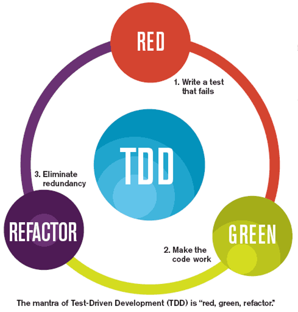

# Test Driven ~~Development~~ Design
- Specification-first
- Design methodology

---
# Why TDD?
- Testable code
- Enables refactoring
- Less bugs and regressions
- Avoids over-engineering
- Fun! :relaxed:
